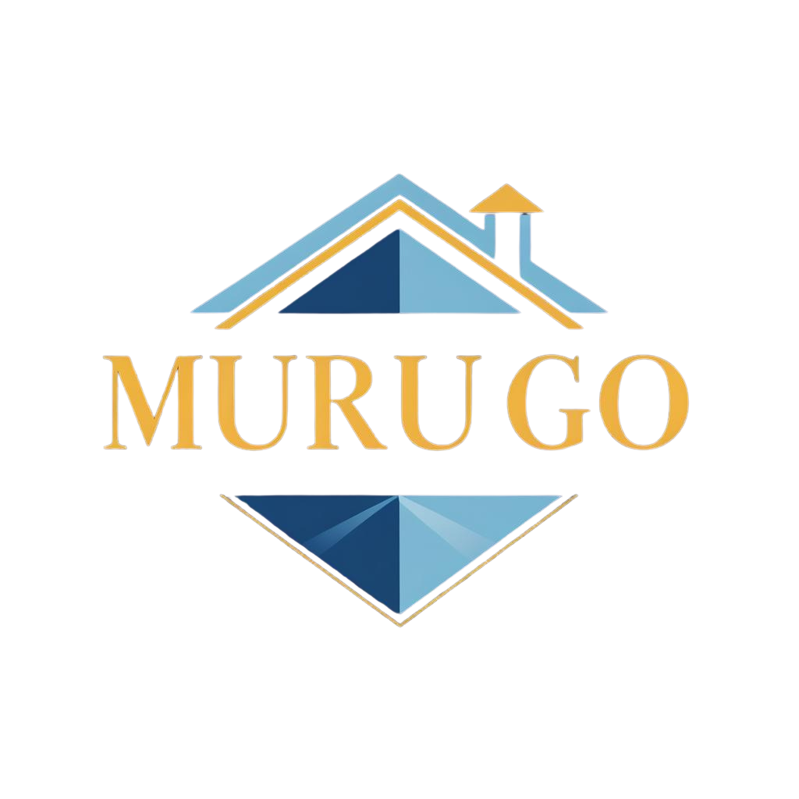

<div align="center">
  
  
  # Murugo Real Estate Platform
  
  **Find Your Perfect Home in Rwanda**
  
  [](https://laravel.com)
  [](https://php.net)
  [](https://postgresql.org)
  [](https://tailwindcss.com)
  [](LICENSE)
</div>

---

## 🏠 About Murugo

Murugo is a comprehensive real estate platform designed specifically for the Rwandan market, connecting renters with landlords through an intuitive, modern interface. Built with enterprise-grade security and scalability in mind, Murugo provides a seamless experience for property discovery, listing, and management.

### ✨ Key Features

- 🏘️ **Property Listings** - Comprehensive property management with photos, amenities, and location data
- 🔍 **Advanced Search** - Filter by location, price, property type, and amenities
- 🗺️ **Interactive Maps** - Visual property search with Mapbox integration
- 💬 **Messaging System** - Secure communication between renters and landlords
- 👥 **Role-Based Access** - Separate dashboards for renters, landlords, and administrators
- 🌍 **Multi-Language Support** - English, French, and Kinyarwanda
- 🔒 **Enterprise Security** - Database sessions, encryption, and financial-grade security
- 📱 **Responsive Design** - Optimized for desktop, tablet, and mobile devices

---

## 🛠️ Tech Stack

### Backend
- **Framework**: Laravel 10.x
- **Language**: PHP 8.2+
- **Database**: PostgreSQL 14+
- **Session Storage**: Database-driven with encryption
- **Authentication**: Laravel Breeze with role-based access

### Frontend
- **Templating**: Blade Templates
- **Styling**: Tailwind CSS 3.x
- **JavaScript**: Alpine.js
- **Icons**: Heroicons
- **Maps**: Mapbox API

### Infrastructure
- **Web Server**: Nginx
- **Process Manager**: Supervisor
- **Containerization**: Docker
- **Operating System**: Ubuntu 22.04 LTS
- **SSL**: Let's Encrypt

### Development Tools
- **Package Manager**: Composer
- **Build Tool**: Vite
- **Version Control**: Git
- **Code Quality**: PHP CS Fixer

---

## 🚀 Quick Start

### Prerequisites

- PHP 8.2 or higher
- Composer
- Node.js 18+ and npm
- PostgreSQL 14+
- Git

### Installation

1. **Clone the repository**
   ```bash
   git clone https://github.com/Ikaze-Murugo/turbo-disco.git
   cd turbo-disco
   ```

2. **Install dependencies**
   ```bash
   composer install
   npm install
   ```

3. **Environment setup**
   ```bash
   cp .env.example .env
   php artisan key:generate
   ```

4. **Database configuration**
   ```bash
   # Update your .env file with database credentials
   DB_CONNECTION=pgsql
   DB_HOST=127.0.0.1
   DB_PORT=5432
   DB_DATABASE=murugo_production
   DB_USERNAME=your_username
   DB_PASSWORD=your_password
   ```

5. **Run migrations and seeders**
   ```bash
   php artisan migrate --seed
   ```

6. **Build assets**
   ```bash
   npm run build
   ```

7. **Start the development server**
   ```bash
   php artisan serve
   ```

Visit `http://localhost:8000` to see the application.

---

## 🏗️ Project Structure

```
murugo-app/
├── app/
│   ├── Http/Controllers/     # Application controllers
│   ├── Models/               # Eloquent models
│   ├── Services/             # Business logic services
│   └── Middleware/           # Custom middleware
├── database/
│   ├── migrations/           # Database migrations
│   └── seeders/             # Database seeders
├── resources/
│   ├── views/                # Blade templates
│   ├── css/                  # Stylesheets
│   └── js/                   # JavaScript files
├── routes/
│   ├── web.php               # Web routes
│   └── api.php               # API routes
└── public/
    ├── images/               # Static images
    └── storage/              # File storage
```

---

## 🔧 Configuration

### Environment Variables

Key environment variables for production:

```env
# Application
APP_NAME="Murugo Real Estate"
APP_ENV=production
APP_DEBUG=false
APP_URL=https://murugo.dadishimwe.com

# Database
DB_CONNECTION=pgsql
DB_HOST=127.0.0.1
DB_PORT=5432
DB_DATABASE=murugo_production
DB_USERNAME=murugo_app
DB_PASSWORD=your_secure_password

# Session Security
SESSION_DRIVER=database
SESSION_LIFETIME=60
SESSION_ENCRYPT=true
SESSION_SECURE_COOKIE=true
SESSION_HTTP_ONLY=true
SESSION_SAME_SITE=strict

# Maps
MAPBOX_ACCESS_TOKEN=your_mapbox_token
```

---

## 🚀 Deployment

### Docker Deployment

1. **Build and start containers**
   ```bash
   docker compose up -d
   ```

2. **Run migrations**
   ```bash
   docker compose exec murugo php artisan migrate
   ```

3. **Build assets**
   ```bash
   docker compose exec murugo npm run build
   ```

### Manual Deployment

See [DEPLOYMENT_GUIDE.md](DEPLOYMENT_GUIDE.md) for detailed deployment instructions.

---

## 📚 Documentation

- [Design System](NEW_DESIGN_SYSTEM.md) - UI/UX guidelines and components
- [Internationalization Guide](INTERNATIONALIZATION_GUIDE.md) - Multi-language support
- [Deployment Guide](DEPLOYMENT_GUIDE.md) - Production deployment
- [Styling Examples](STYLING_EXAMPLES.html) - CSS and component examples

---

## 🔒 Security Features

- **Database Session Storage** - Sessions stored in PostgreSQL with encryption
- **Secure Cookies** - HTTP-only, secure, and same-site cookies
- **CSRF Protection** - Built-in Laravel CSRF tokens
- **Input Validation** - Comprehensive form validation
- **Role-Based Access Control** - Granular permissions system
- **Financial Security** - Enhanced security for payment operations

---

## 🤝 Contributing

We welcome contributions! Please see our [Contributing Guidelines](CONTRIBUTING.md) for details.

1. Fork the repository
2. Create a feature branch (`git checkout -b feature/amazing-feature`)
3. Commit your changes (`git commit -m 'Add amazing feature'`)
4. Push to the branch (`git push origin feature/amazing-feature`)
5. Open a Pull Request

---

## 📄 License

This project is licensed under the MIT License - see the [LICENSE](LICENSE) file for details.

---

## 🆘 Support

- **Documentation**: Check our comprehensive guides in the `/docs` folder
- **Issues**: Report bugs and request features via [GitHub Issues](https://github.com/Ikaze-Murugo/turbo-disco/issues)
- **Email**: hello@murugo.com

---

## 🏆 Acknowledgments

- Built with ❤️ for the Rwandan real estate market
- Inspired by modern design principles and user experience best practices
- Powered by the Laravel ecosystem and open-source community

---

<div align="center">
  <p>Made with ❤️ in Rwanda</p>
  <p>© 2024 Murugo Real Estate Platform. All rights reserved.</p>
</div>